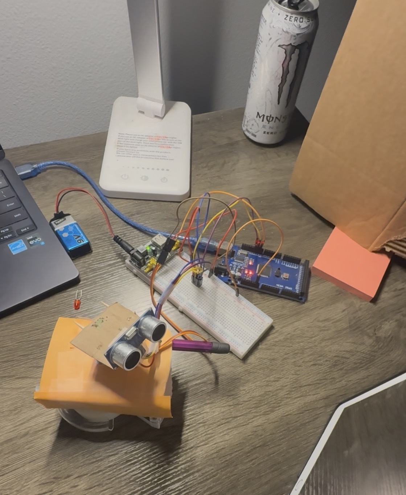
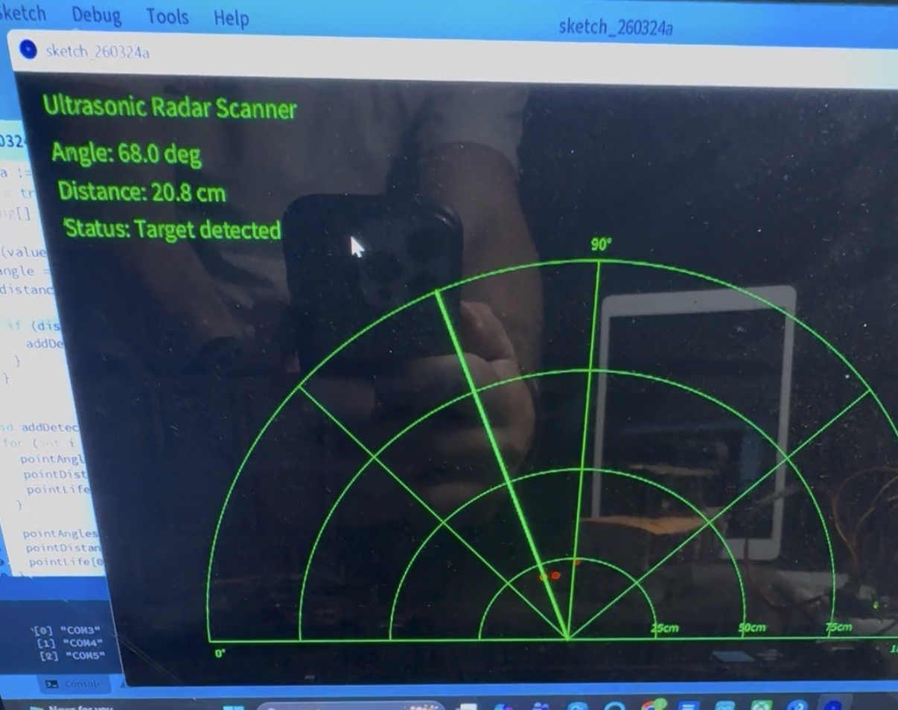

# Ultrasonic Radar Scanner

This project is a real-time ultrasonic scanning system built using an Arduino, an HC-SR04 ultrasonic sensor, and a servo motor. The system sweeps across a range of angles, measures distance to nearby objects, and visualizes the results in a radar-style display using Processing.

## System Overview

- Ultrasonic sensor mounted on a servo motor to perform angular scanning  
- Arduino collects angle–distance measurements  
- Serial communication streams data to a Processing application
- Processing displays a live radar-style interface with sweep line and detected objects  

## Key Features
 
- Real-time object detection and visualization  
- Integration of sensor input, actuator control, and software visualization  
- Adjustable scan range and sampling rate  
- Radar-style display with fading detection points  

## Hardware Components

- Arduino MEGA 2560  
- HC-SR04 Ultrasonic Sensor  
- SG90 Micro Servo Motor  
- Breadboard and jumper wires  
- External power module for stable operation  

## Software Components

- Arduino IDE (C/C++) for embedded control  
- Processing for real-time visualization  

## Challenges & Debugging

This project involved significant system-level debugging, including:

- Noisy and inconsistent sensor readings  
- Power distribution issues affecting servo stability  
- Mechanical mounting constraints for the rotating sensor  
- Intermittent breadboard connections  

These challenges were addressed through iterative testing, parameter tuning, and hardware adjustments.

## What I Learned

- Integrating multiple subsystems (sensor, actuator, visualization) into a working system  
- Debugging real-world hardware issues beyond ideal theoretical conditions  
- Managing noisy data and improving system reliability  
- Translating raw sensor data into meaningful visual output  

## Project Demo

https://drive.google.com/file/d/182Qmv5oS9xinBDu94A54QVwTsWGlwBTO/view?usp=drive_link

### Hardware Setup

### Radar Visualization

## Future Improvements

- Improve mechanical stability for smoother scanning  
- Invest in more reliable components
- Implement filtering for more stable distance readings  
- Add additional sensors for improved coverage  
